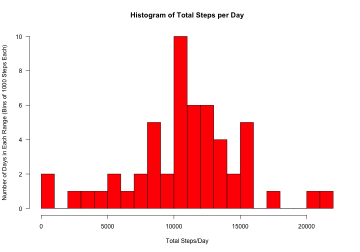
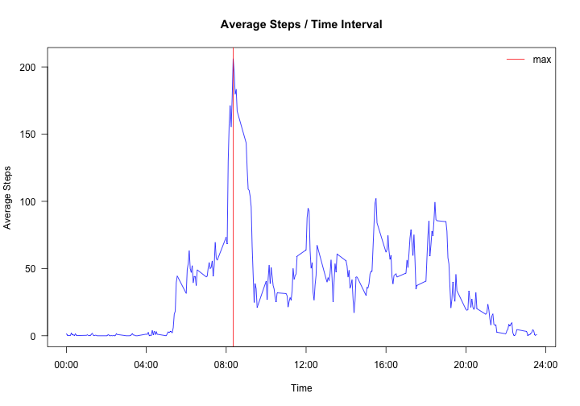
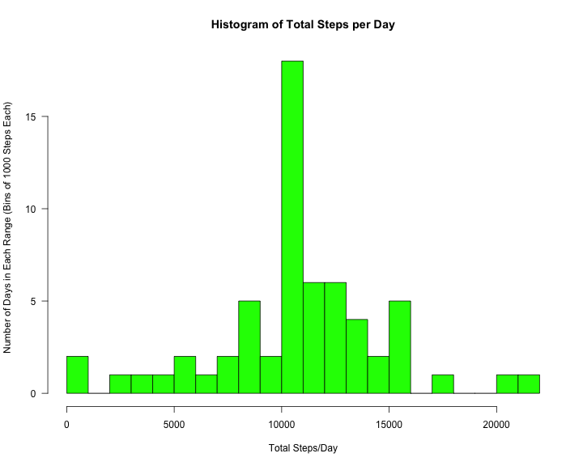
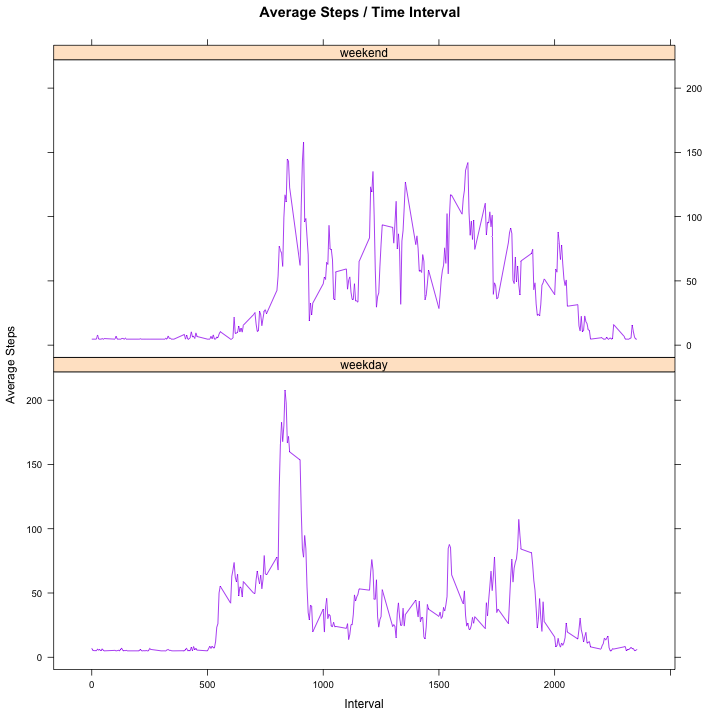

### 1. Loading and preprocessing the data

#### 1.0 Load necessary packages after simple check to see if installed
* __pkgs:__ is a vector of the packages required to run the script
* __pkg:__ is an element of pkgs
* The script checks if the required libraries are already available then                installs those that are not.
* NOTE: Warnigs are supresed to eliminate cluttered appearance when running script.


```r
pkgs <- c("data.table","lattice")
for(pkg in pkgs){
     if(!require(pkg,character.only=T)){
          suppressWarnings(require(pkg,quietly=T,warn.conflicts=F))
     }
}

## Set present directory as home directory
WD <- getwd()
```

#### 1.1 Read the dataset 
* Check if there is a folder ./DATA in the working directory. IF not create one.
* Change working directory to the ./DATA folder.
* __url__ : An object of type character, containing the location of the data to be used for the exercise.
* The file activity.zip is downloaded to the ./DATA folder.
* The file is unzipped and activity.csv is read into a data table.
* __activity_DT__ : The complete original dataset.
* A prieview of the data table is displayed


```r
if(!file.exists("./DATA")){dir.create("./DATA")}
setwd("./DATA")
url <- "http://d396qusza40orc.cloudfront.net/repdata%2Fdata%2Factivity.zip"
download.file(url,"activity.zip",method="wget",quiet=T)
unzip("activity.zip")
activity_DT <- fread("activity.csv")
activity_DT
```

```
##        steps       date interval
##     1:    NA 2012-10-01        0
##     2:    NA 2012-10-01        5
##     3:    NA 2012-10-01       10
##     4:    NA 2012-10-01       15
##     5:    NA 2012-10-01       20
##    ---                          
## 17564:    NA 2012-11-30     2335
## 17565:    NA 2012-11-30     2340
## 17566:    NA 2012-11-30     2345
## 17567:    NA 2012-11-30     2350
## 17568:    NA 2012-11-30     2355
```

```r
setwd(WD)
```

### 2. What is the mean total number of steps taken per day?
#### 2.1 Calculate total and mean number of steps per day1
* Using base data.table commands, creates a data table with three columns: date, mean.steps, and total.steps.
* __trim_DT:__ data consolidated to by date
     + __mean.steps:__ average number of steps each day
     + __total.steps:__ sum of steps taken each day
* Prints the head of the new data table


```r
trim_DT <- activity_DT[,list(total.steps=sum(steps),mean.steps=mean(steps)),by='date']
head(trim_DT)
```

```
##          date total.steps mean.steps
## 1: 2012-10-01          NA         NA
## 2: 2012-10-02         126    0.43750
## 3: 2012-10-03       11352   39.41667
## 4: 2012-10-04       12116   42.06944
## 5: 2012-10-05       13294   46.15972
## 6: 2012-10-06       15420   53.54167
```

#### 2.2 Plot histogram of total number of steps taken per day


```r
hist(trim_DT[,total.steps],
     breaks=25,
     col="red",
     xlab="Total Steps/Day",
     ylab="Number of Days in Each Range (Bins of 1000 Steps Each)",
     main="Histogram of Total Steps per Day",
     las=1
     )
```

 

#### 2.3 Calculate & report mean and median of total number of steps taken per day

* Here we use the trim_DT data and remove all NA values when making calculations.


```r
mean.total.steps <- mean(trim_DT[,total.steps],na.rm=T)
```


```r
median.total.steps <- median(trim_DT[,total.steps],na.rm=T)
```


```r
abs(mean.total.steps - median.total.steps)
```

```
## [1] 1.188679
```

### 3. What is the average daily activity pattern?

The daily activity pattern follows what we would expect with few or no steps during time periods typically associated with sleeping hours, aproximately 10 pm until about 6 am. We then see a spike of movement during the 8 am hour which we can associate with readying onself for work or morning excercise. We see that our peak occurs at about 8:30 am. Finally, throughout most of the day we see moderate totals with peaks and valleys that we can assume reperesents patterns of sitting and standing during the course of a typical work day. Since we have averaged over each interval across all days we know the pattern does not indicate any one type of lifestyle but rather a general look a combination of job types ranging from very physical like that of a UPS driver and very sedintary like for example say an accountant.

#### 3.1 Plot a time series

* First, I created a time series to append to the full data set using ISOdatetime by 5 minute intervals
* __datetimes:__ a vector for complete date and times with same length as original data set
* Next I converted them to factors and seperated out the first 288 elements (24 hours).
* __times:__ a vector of length 288 with times coinciding with 5 min intervals in 24 hour day
* Then I aggregated the the original data set calculating the mean number of steps for each time interval over all days and removing NA data.


```r
datetimes <- seq(ISOdatetime(2012,10,01,0,0,0,tz="GMT"),ISOdatetime(2012,11,30,23,55,0,tz="GMT"),by=(60*5))

times <- as.factor(format(datetimes[1:288],"%H:%M"))

interval_DT <- data.table(
     aggregate(steps ~ interval,
               data=activity_DT,
               mean,
               na.rm=T)
)

interval_DT <- interval_DT[,times:=times]
interval_DT
```

```
##      interval     steps times
##   1:        0 1.7169811 00:00
##   2:        5 0.3396226 00:05
##   3:       10 0.1320755 00:10
##   4:       15 0.1509434 00:15
##   5:       20 0.0754717 00:20
##  ---                         
## 284:     2335 4.6981132 23:35
## 285:     2340 3.3018868 23:40
## 286:     2345 0.6415094 23:45
## 287:     2350 0.2264151 23:50
## 288:     2355 1.0754717 23:55
```

* Plot the average number of steps per interval vs. time interval.
* Create the labels for the x-axis.
* And, format the plot.


```r
plot(interval_DT$interval,interval_DT$steps,
     type="l",
     xlab="Time",
     ylab="Average Steps",
     main="Average Steps / Time Interval",
     col="blue",
     yaxt="n",
     xaxt="n"
     
)
abline(v=835,col="red")
legend(x="topright", legend="max", col="red", bty="n",lwd=1)
axis(side=2,las=2)

axis(side=1,
     las=0,
     at=c(0,400,800,1200,1600,2000,2400),
     labels=c("00:00","04:00","08:00","12:00","16:00","20:00","24:00")
     )
```

 

#### 3.2 Find the interval with the greatest average number of steps


```r
interval_DT[which.max(interval_DT$steps),]$interval
```

```
## [1] 835
```

### 4. Imputing missing values
#### 4.1 Report the number of rows containing ‘NA’ values


```r
colSums(is.na(activity_DT))
```

```
##    steps     date interval 
##     2304        0        0
```

#### 4.2 Calculate average of non ‘NA’ values for “steps” variable to fill missing data

* __fill:__ a calculated value used the replace all the NA values in steps
* __fill__ was calculated by taking the mean of the full dataset without NA values


```r
fill <- mean(activity_DT[,steps],na.rm=T)
```

#### 4.3 Plot filled data histogram

* __activity_DT2:__ data table of the original data with NA’s replaced by __fill__ value
* __filled_DT:__ data table with NA’s filled and aggragated by date with 3 variables
+ __date:__ column of dates in MM-DD-YYYY format
+ __total.steps:__ column of sum of all steps over all intervals for each day
+ __mean.steps:__ column of mean values of steps taken over all intervals for each day
* Head and tail of __filled_DT__ printed
* Print the histogram


```r
activity_DT2 <- replace(activity_DT,is.na(activity_DT),fill)
filled_DT <- activity_DT2[,list(total.steps=sum(steps),mean.steps=mean(steps)),by="date"]

head(filled_DT)
```

```
##          date total.steps mean.steps
## 1: 2012-10-01    10766.19   37.38260
## 2: 2012-10-02      126.00    0.43750
## 3: 2012-10-03    11352.00   39.41667
## 4: 2012-10-04    12116.00   42.06944
## 5: 2012-10-05    13294.00   46.15972
## 6: 2012-10-06    15420.00   53.54167
```


```r
tail(filled_DT)
```

```
##          date total.steps mean.steps
## 1: 2012-11-25    11834.00   41.09028
## 2: 2012-11-26    11162.00   38.75694
## 3: 2012-11-27    13646.00   47.38194
## 4: 2012-11-28    10183.00   35.35764
## 5: 2012-11-29     7047.00   24.46875
## 6: 2012-11-30    10766.19   37.38260
```


```r
hist(filled_DT[,total.steps],
     breaks=25,
     col="green",
     xlab="Total Steps/Day",
     ylab="Number of Days in Each Range (Bins of 1000 Steps Each)",
     main="Histogram of Total Steps per Day",
     las=1
     )
```

 

### 4.4: calculate the mean & median value of total steps from filled dataset

* Calculate the mean of the filled data
* Calculate the medaian of the filled date
* Calculate the diffrence between the two values for purpose of analysis


```r
filled.mean.total.steps <- mean(filled_DT[,total.steps],na.rm=T)
filled.mean.total.steps
```

```
## [1] 10766.19
```


```r
filled.median.total.steps <- median(filled_DT[,total.steps],na.rm=T)
filled.median.total.steps
```

```
## [1] 10766.19
```


```r
abs(filled.mean.total.steps - filled.median.total.steps)
```

```
## [1] 0
```

#### 4.5 Compare filled data to original data

We see that the mean values have a differince of zero, while the median values differ slightly. This is most probably caused by our choice of methods for filling the missing data points which involved use of the calculated mean over the entire data set. But, this skewed the median value of the filled data slightly. Had we used a median value to fill the missing data points we would have seen skew in the mean of the mean values. 


```r
abs(filled.median.total.steps - median.total.steps)
```

```
## [1] 1.188679
```


```r
abs(filled.mean.total.steps - mean.total.steps)
```

```
## [1] 0
```

### 5. Are there differences in activity patterns between weekdays and weekends?

From the panel plots created below we can see that the weekday and weekend data does vary. On the weekends we see a more active graph with relatively consistant peaks and troughs that seem to cycle in a regular consistent fashion between aproximately 8 am and 9 pm. Whereas on the the weekdays we see a plot more consistant with our original time series plot, with a single maximum peak around 8:30 am followed by smaller peaks and troughs through about 8 pm or so. In both graphs we see little movement after 10 pm and through the early mornign hours. An additional not should be made of the earlier start of movement that occurs on the weekdays, while activity commences almost 3 hours later on the weekends.

#### 5.2 Add factor variable to dataset indicating whether a date is a weekday of weekend

* __days:__ vector of strings added to __activity_DT2__ indicating the day of the week created by the __weekdays()__ function (all days are abbreviated)
* __type:__ factor vector with 2 levels indicating whether the day is a __weekend or weekday__
* __weekdays()__ function is called to creaate __days__ from which __type__ is determined


```r
activity_DT2[,days:=weekdays(datetimes,abbreviate=T)]
```

```
##          steps       date interval days
##     1: 37.3826 2012-10-01        0  Mon
##     2: 37.3826 2012-10-01        5  Mon
##     3: 37.3826 2012-10-01       10  Mon
##     4: 37.3826 2012-10-01       15  Mon
##     5: 37.3826 2012-10-01       20  Mon
##    ---                                 
## 17564: 37.3826 2012-11-30     2335  Fri
## 17565: 37.3826 2012-11-30     2340  Fri
## 17566: 37.3826 2012-11-30     2345  Fri
## 17567: 37.3826 2012-11-30     2350  Fri
## 17568: 37.3826 2012-11-30     2355  Fri
```


```r
activity_DT2$type <- factor(activity_DT2[,days] %in% c("Sat","Sun"))
levels(activity_DT2$type)[levels(activity_DT2$type)=="TRUE"] <- "weekend"
levels(activity_DT2$type)[levels(activity_DT2$type)=="FALSE"] <- "weekday"
```

#### 5.3 Make a panel plot containing a time series plot of the 5-minute interval (x-axis) and the average number of steps taken, averaged across all weekday days or weekend days (y-axis)

* __interval_DT2:__ data table containing the average number of steps per for each 5 minute interval over all days
* Once the data table is created __xyplot()__ function from the __lattice package__ is called to plot the data.
* Additional code is used to format the output of the plot making it easier to see and read the resulting graph.


```r
interval_DT2 <- data.table(aggregate(steps ~ interval + type,
               data=activity_DT2,
               mean,
               na.rm=T)
               )

interval_DT2
```

```
##      interval    type     steps
##   1:        0 weekday  7.006569
##   2:        5 weekday  5.384347
##   3:       10 weekday  5.139902
##   4:       15 weekday  5.162124
##   5:       20 weekday  5.073235
##  ---                           
## 572:     2335 weekend 15.672825
## 573:     2340 weekend 10.547825
## 574:     2345 weekend  6.297825
## 575:     2350 weekend  4.672825
## 576:     2355 weekend  4.672825
```


```r
print(xyplot(steps ~ interval | as.factor(type),
     type="l",        
     data = interval_DT2,
     layout=c(1,2),
     xlab="Interval",
     ylab="Average Steps",
     main="Average Steps / Time Interval",
     col="purple"
     )
)
```

 
